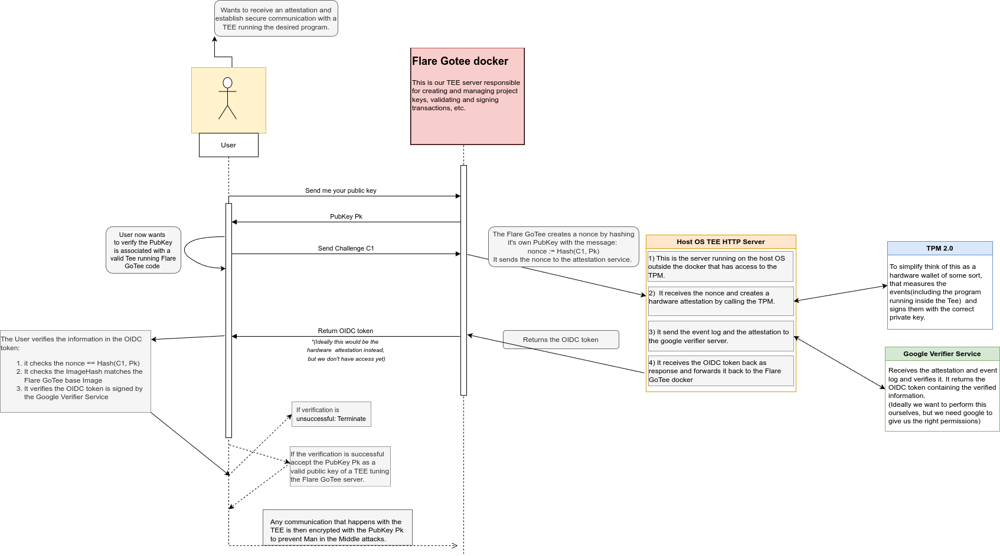

# System Architecture Docs

## Attestation Flow

This is the attestation Flow that would happen each time a User wants to establish a secure connection with the server running inside the TEE. The User wants to verify that the server it is communicating with is infact running the correct code inside a valid intel TDX or AMD SEV enabled VM and exchange a public key that will be used for secure communication.

